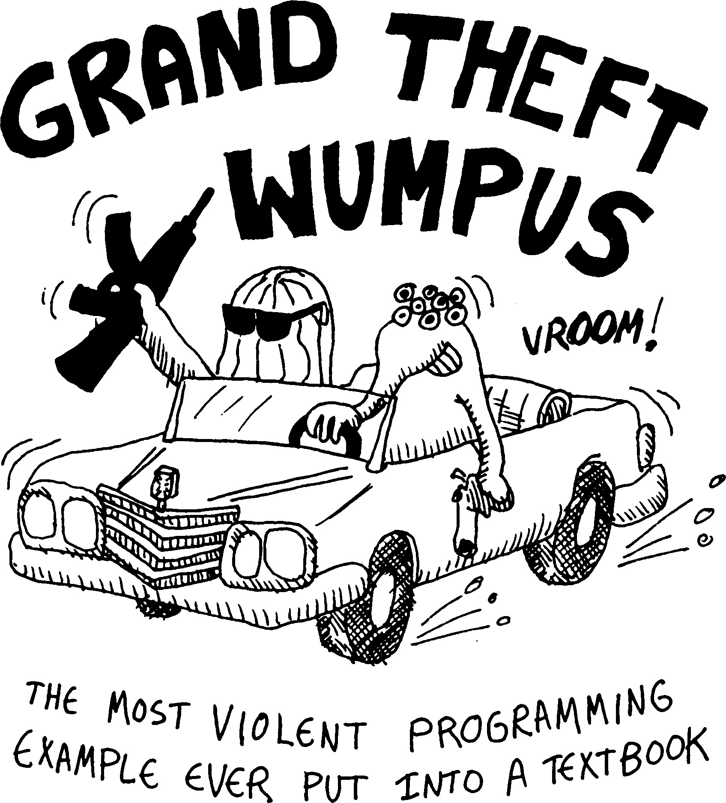

# 🏹 Wumpus World Hunt Game

## 📖 Introduction
Welcome to the **Wumpus World Hunt** game! This project is based on the classic AI problem set in a grid-based environment known as the Wumpus World. In this game, I, the developer, have created a puzzle-like environment where you, as the "agent," must navigate through a cave filled with hazards to locate and retrieve a treasure (gold) and then safely exit the cave. Your primary challenge is to avoid deadly pits and the terrifying Wumpus, a fearsome creature lurking in one of the rooms.

This game showcases concepts of decision-making under uncertainty, logical reasoning, and the implementation of artificial intelligence techniques. It serves as a perfect platform for exploring AI principles, especially in developing strategies for dealing with incomplete and uncertain information.




## ❓ Problem Statement
In the **Wumpus World Hunt**, you take on the role of an agent in a 4x4 grid world. Your objective is to find and retrieve a piece of gold while avoiding hazards, including bottomless pits and the deadly Wumpus. You're equipped with a single arrow that can be used to kill the Wumpus, but you have only one shot.

The agent must navigate through the grid based on percepts received from the environment, such as:

- **💨 Breeze:** Felt in adjacent squares to a pit.
- **👃 Stench:** Smelt in adjacent squares to the Wumpus.
- **✨ Glitter:** Seen in the square where the gold is located.
- **💥 Bump:** Indicates the agent has walked into a wall.
- **🗣️ Scream:** Heard if the Wumpus is hit by the arrow and killed.

The challenge is to develop an AI that can intelligently infer the positions of pits and the Wumpus based on these percepts, retrieve the gold, and exit the cave alive.

## 🔍 Scope
The **Wumpus World Hunt** is a foundational problem in the study of artificial intelligence, particularly in areas related to:

- **🧠 Logical Agents:** The game requires the use of propositional and first-order logic to reason about the environment.
- **🔍 Search Algorithms:** The agent must explore the grid, keeping track of safe and unsafe squares, and plan its moves to achieve the objective.
- **📚 Knowledge Representation:** The game involves representing knowledge about the environment and updating this knowledge as new information is acquired.
- **🎯 Decision Making Under Uncertainty:** The agent must make decisions based on incomplete information, balancing the risks and rewards of different actions.

## 🎮 Game Rules and Mechanics
1. **🗺️ Grid Layout:** The game takes place on a 4x4 grid. The agent starts at the bottom-left corner of the grid (position [1,1]).
2. **⚠️ Hazards:**
   - **👹 Wumpus:** The Wumpus is a dangerous creature that will eat the agent if they enter its room. It can be killed if the agent successfully shoots the arrow into the Wumpus's room.
   - **🕳️ Pits:** Falling into a pit results in immediate death. Pits are randomly distributed across the grid.
   - **💰 Gold:** The objective is to find and collect the gold, which is located in a random room.
3. **👂 Percepts:** The agent receives percepts (Breeze, Stench, Glitter, Bump, and Scream) that provide clues about the environment.
4. **🕹️ Actions:** The agent can move forward, turn left or right, grab the gold, shoot the arrow, and climb out of the cave.

## 🧩 Sample Python Program
I present to you a sample Python program that simulates the Wumpus World environment. Here's the initial environment setup I've created:

```plaintext
  0   1   2   3   4   5    time_step=0
|---|---|---|---|---|---|
| # | # | # | # | # | # | 5
|---|---|---|---|---|---|
| # |   |   |   |   | # | 4
|---|---|---|---|---|---|
| # | W | G | P |   | # | 3
|---|---|---|---|---|---|
| # |   |   |   |   | # | 2
|---|---|---|---|---|---|
| # | ^ |   | P |   | # | 1
|---|---|---|---|---|---|
| # | # | # | # | # | # | 0
|---|---|---|---|---|---|

W: Wumpus
G: Gold
P: Pit
^: Agent's initial position and orientation 
```

This setup serves as a starting point for the agent to begin exploring the world, applying logical reasoning to avoid hazards, locate the gold, and plan an escape route.
## 🏁 Conclusion
The **Wumpus World Hunt** game serves as a compelling introduction to many fundamental concepts in AI. Whether used as a teaching tool in academic settings or as a challenge for AI enthusiasts, it offers rich opportunities for learning and exploration in the field of artificial intelligence.

### 🚀 About Me

Hi, I'm Anna! 👋

I am an AI Enthusiast and Data science & ML practitioner
